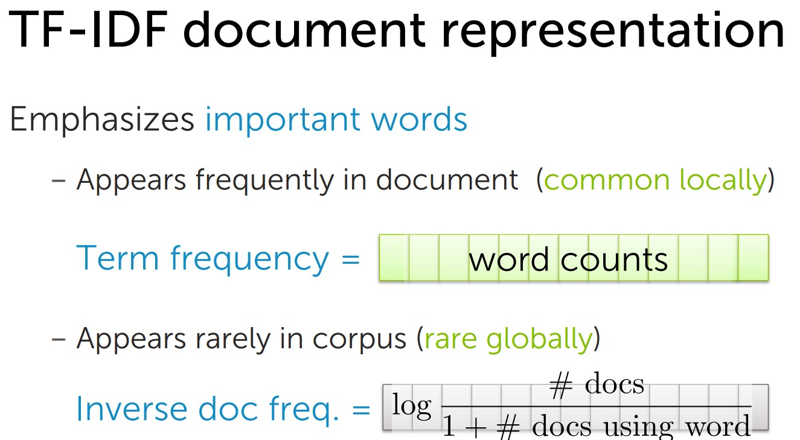
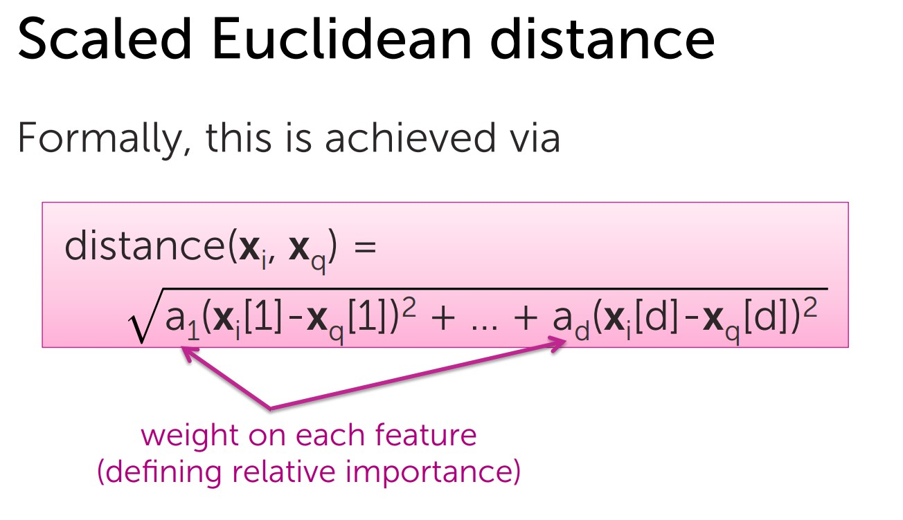
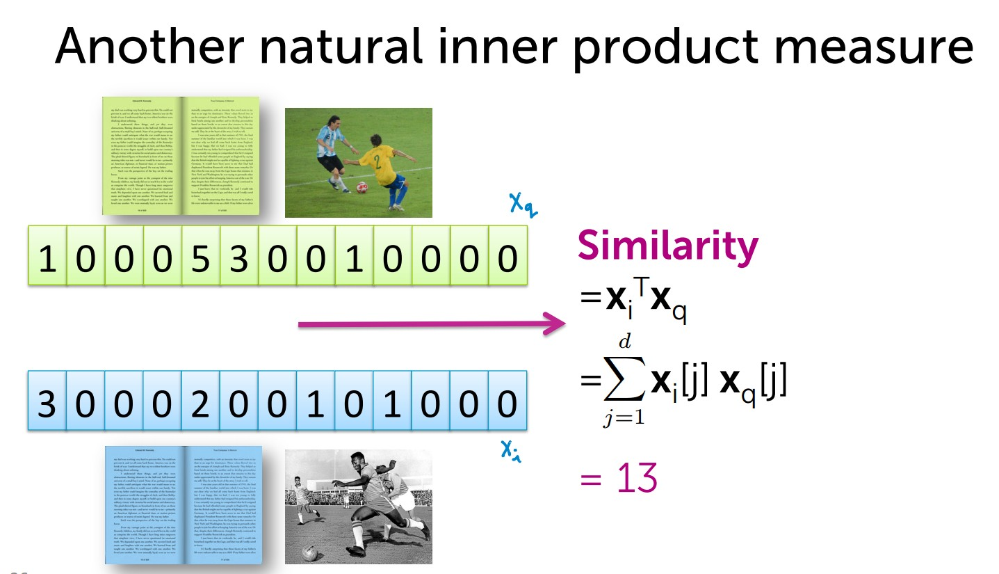

# Clustering and retrieval

- retrieval: search for related items. e.g. wiki articles
- clustering: Discover groups of similar inputs

#  Nearest neighbor search

Critical elements:

-  Doc representation
-  Distance measure

Techniques to improve efficiency

- KD trees
- Locality sensitive hashing / LSH

## Doc representation 

Bag of words model
- Ignore order of words
- Count # of instances of each word in vocabulary

Issues with word counts  Rare words

## TF-IDF document representation
- Emphasizes important words
    - Appears frequently in document (common locally)
    - Appears rarely in corpus (rare globally)

TF = Word counts

Trade off: local frequency vs. global rarity

## Distance metrics

- In 1D
    - just Euclidean distance:
- In multiple dimensions:
    - can define many interesting distance functions
    - most straightforwardly, might want to weight different dimensions differently
- Weighting different features
    - Some features are more relevant than others (e.g. title and abstract vs body od text)
    - Some features vary more than others: Specify weights as a function of feature spread
### euclidean

### Cosine similarity – normalize

- not a proper distance metric
- efficient to compute on sparse vecs
- Define distance = 1-similarity

Normalizing can make dissimilar objects appear more similar

Other distance metrics
- Mahalanobis
- rank-based
- correlation-based
- Manhattan
- Jaccard
- Hamming
