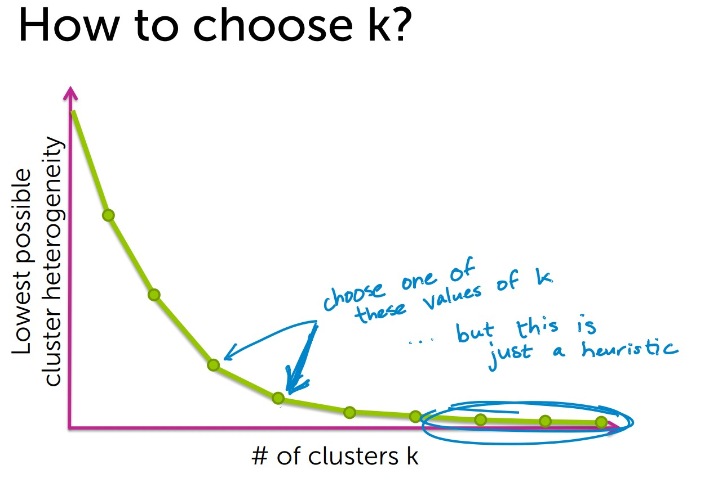
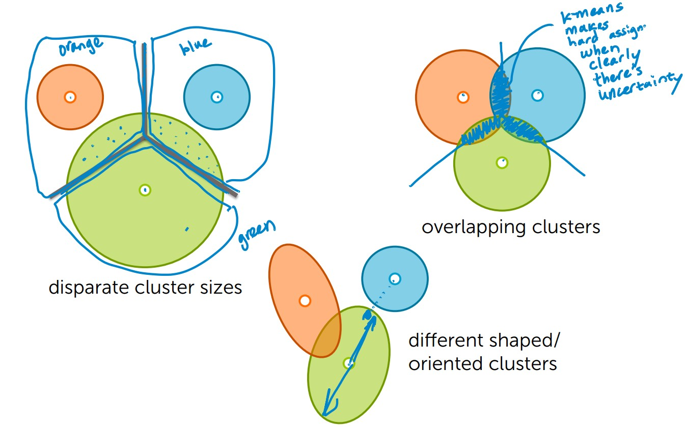
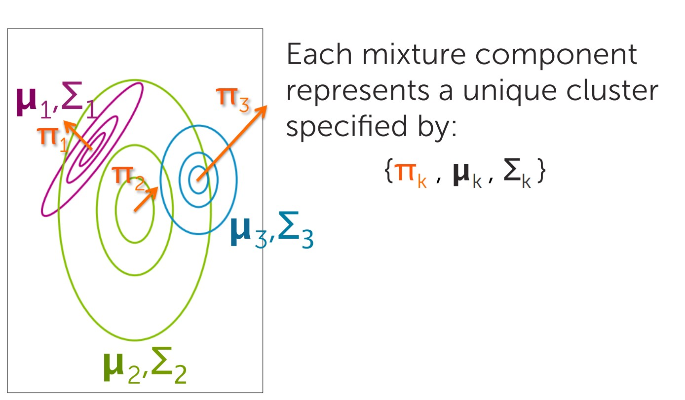

# Clustering and retrieval

- retrieval: search for related items. e.g. wiki articles
- clustering: Discover groups of similar inputs

#  Nearest neighbor search

Critical elements:

-  Doc representation
-  Distance measure

Techniques to improve efficiency

- KD trees
- Locality sensitive hashing / LSH

## Doc representation 

Bag of words model
- Ignore order of words
- Count # of instances of each word in vocabulary

Issues with word counts  Rare words

## TF-IDF document representation
- Emphasizes important words
    - Appears frequently in document (common locally)
    - Appears rarely in corpus (rare globally)

TF = Word counts

Trade off: local frequency vs. global rarity

## Distance metrics

- In 1D
    - just Euclidean distance:
- In multiple dimensions:
    - can define many interesting distance functions
    - most straightforwardly, might want to weight different dimensions differently
- Weighting different features
    - Some features are more relevant than others (e.g. title and abstract vs body od text)
    - Some features vary more than others: Specify weights as a function of feature spread
### euclidean

### Cosine similarity – normalize

- not a proper distance metric
- efficient to compute on sparse vecs
- Define distance = 1-similarity

Normalizing can make dissimilar objects appear more similar

Other distance metrics
- Mahalanobis
- rank-based
- correlation-based
- Manhattan
- Jaccard
- Hamming

# K Means

## Dummy description

It's an unsupervised learning technique. No labels are provided. The final model is given by K clusters each one with a "center". The data points are assigned to the cluster to which they are assigned to. Since there's only one assignment, this are called hard assignments. 

The cluster centers are determined through an iterative algorithm. You initialize with a set of cluster centers. These can be random, or initialized in a smarter fashion like K means ++. Then you calculated the distance from each point to each cluster and assign them to the one they are closest two. That's step one. Step 2 is to then redefine the cluster center using the mean of the newly assigned points.  You repeat until you converge to a local optimum (typicall when the change in sum of squares is smaller than some threshold).

## What defines a cluster?

- Cluster defined by center & shape/spread

Assign observation xi (doc)to cluster k (topic label) if: 

-  Score under cluster k is higher than under others

## K means 

- Score = distance to cluster center (smaller better)
    - For simplicity, often define score as distance to cluster center (ignoring shape)
    
0. Initialize cluster centers
1. Assign observations to closest cluster center  
2. Revise cluster centers as mean of assigned observations
3. Repeat 1.+2. until convergence (to a local optimum)

Can be implemented as coordinate descent algorithm

## smart initialization with k means ++

Smart initialization:
1.  Choose first cluster center uniformly at random from data points
2.  For each obs x, compute distance d(x) to nearest cluster center. (i.e. more likely to choose a datapoint as a cluster center if  the data point is far away) 
3.  Choose new cluster center from amongst data points, with probability of x being chosen proportional to d(x)^2
4.  Repeat Steps 2 and 3 until k centers have been chosen

- Computationally costly relative to random initialization, but the subsequent k-means often converges more rapidly
- Tends to improve quality of local optimum and lower runtime

# What happens as k increases

- K means attempts to minimize the sum of squared distances
- An heteroreneous cluster has dissimilar objects within a single cluster. i.e. the distance from the points to the cluster center is relatively large to another cluster. this is measured by the sum of squared distances.
- as K increases, overfitting occurss.
- The extreme case is K = Size of data, in which case the heterogenity/RSS is 0!

## Choosing K

Heuristic

# Mixture models (mixture of gaussians)

## Dummy description

K means essentially establishes clusters by calculating the distance from the points to the cluster center. This means that the cluster is essentially espherical. It also performs hard assigments. A data point belongs only to one cluster, even if it's near the intersection of 2. It also doesn't have support for clusters with different shapes/orientation.

The mixture of gaussian solves these problems by defining the cluster as a multi dimensional gaussian distribution. It has a cluster center but it also has the typical spread parameters of gaussians. Clusters are assigned based on the likelihood of actually seeing the data point under each gaussian  distribution. A data point will be more likely under some distribution than others, but it's never 0. The point belongs to all clusters, just that it's much more likely under some of them.  in this way, we get non spherical clusters, with different orientations that provide soft assignments.

Note: it also takes into account the prior probability of a randome data point belonging to given cluster when assigning clusters

## Limitations of K means 

- K means provides hard assigments. i.e. one data points belongs to only one cluster.
- Does not account for uncertainty.

## advantages of Mixture models

- Provides soft assignments of observations to clusters (uncertainty in assignment)
    -  e.g., 54% chance document is world news, 45% science, 1% sports, and 0% entertainment
- accounts for cluster shapes not just centers
- Enables learning weightings of dimensions
    -  e.g., how much to weight each word in the vocabulary when computing cluster assignment
    
## Intuition behind them

- One multivariate gaussion per category/cluster. It is defined by 3 things
    - μk: mean/center of the cluster
    - σk: covariace matrix. (i.e. Standard deviation in each possible direction)
    - πk: Relative proportion the class in the world from which we get data. i.e. if 20% of the data belongs to this cluster, then 20%

## Classification on terms
- Prior / πk
    - Without observing the data point,  what’s the probability it’s from cluster k? 
    - p(zi = k) = πk
- Likelihood 
    - Given observation xi is from cluster k, what’s the likelihood of seeing xi?
    - Determined by the gaussian distribution
    - p(xi | zi = k, µk, ⌃k) = N(xi|µk, ⌃k)
    
## Algorithm solution

- Expectation mazimization
- E-step: estimate cluster responsibilities given current parameter estimates
- M-step: maximize likelihood over parameters given current responsibilities
- Can be solved with coordinate ascent algorithm

##  Many ways to initialize the EM algorithm
-  Important for convergence rates and quality of local mode found
-  Examples:
    -  Choose K observations at random to define K “centroids”. Assign other observations to nearest centriod to form initial parameter estimates.
    -  Pick centers sequentially to provide good coverage of data like in k-means++
    -  Initialize from k-means solution
    -  Grow mixture model by splitting (and sometimes removing) clusters until K clusters are formed

## relationship with k means

- If you set the variance parameter -> 0 then you get k means. Why?
    - Spherical clusters. Likelihood becomes equal to cluster center
    - As variance tends towards 0 -> likelihood ratio becomes 0 or 1. we have hard assignments!

